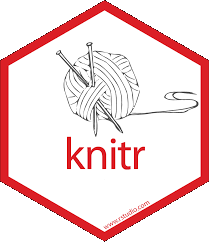

# Document creation

## Previously

:::::::::::::: {.columns align=center}
::: {.column width="50%"}
### (Microsoft) Office

- Non-free editing software
- Proprietary format
- Visual editing
- Non-uniform rendering
:::
::: {.column width="50%"}
{ height=80% }
:::
::::::::::::::

## Beyond the document creation

:::::::::::::: {.columns align=center}
::: {.column width="50%"}
### General drawbacks

- Sharing and collaboration
- Version control
- GitHub / GitLab integration

### Prone to errors

- @zeeberg2004
- @mccullough2005
- @mccullough2008
- @fetzer2020
:::
::: {.column width="50%"}
{ height=80% }
:::
::::::::::::::

## Now

:::::::::::::: {.columns align=center}
::: {.column width="50%"}
{ height=80% }
:::
::: {.column width="50%"}
### PDF

- Open-source format
- Software agnostic
- Uniform rendering

### Rmarkdown

- Markup editing
- Simple version control
- Code integration
- Data management
:::
::::::::::::::


# Different approaches

## WYSIWYG

\centering{\textbf{\textit{What You See Is What You Get}}}

Editing content in a form that is identical to its appearance when displayed as a finished product

### Examples

- [Microsoft Office](https://www.microsoft.com/fr-fr/microsoft-365/)
- [LibreOffice](https://www.libreoffice.org/)
- [Apache OpenOffice](https://www.openoffice.org/fr/)
- [GNU TeXmacs](https://texmacs.org/tmweb/home/welcome.en.html)

## Markup languages

Editing content in a plain text format, where the document contains a set of rules that determine its appearance when displayed a finished product. 

### Examples 

- [Groff](https://www.gnu.org/software/groff/) (Troff, Roff)
- [TeX (LaTeX)](https://www.latex-project.org/)
- HTML
- XML
- [Markdown](https://www.markdownguide.org/)


# Workflow pipeline

## Pipeline outline

:::::::::::::: {.columns}
::: {.column width="50%"}
### Requirements

- Possibility to render PDF (and potentially other formats)
- Simple citations management
- Easy syntax
- Integration with other activities
  * Code execution
  * Scripting
:::
::: {.column width="50%"}
:::
::::::::::::::

## Pipeline outline

:::::::::::::: {.columns}
::: {.column width="50%"}
### Requirements

- Possibility to render PDF (and potentially other formats)
- Simple citations management
- Easy syntax
- Integration with other activities
  * Code execution
  * Scripting
:::
::: {.column width="50%"}
### Solutions

- \textcolor{ugagreen}{Pandoc conversion + PDF LaTeX engine}
- \textcolor{ugagreen}{BibTeX support}
:::
::::::::::::::

## Pandoc

- Wide variety of supported formats
- Possibility to combine *markdown* with other markup syntax formats (LaTeX, HTML, ...)
- Custom templates support
- Document composition
  * In-document YAML configuration
  * External features

## PDF (and other formats) rendering

### Pandoc fully-supported formats

:::::::::::::: {.columns}
::: {.column width="50%"}
- \textcolor<2>{ugagreen}{Markdown}
- RTF, docx, ODT
- \textcolor<2>{ugagreen}{HTML}
- EPUB
:::
::: {.column width="50%"}
- Roff
- \textcolor<2>{ugagreen}{LaTeX, BibTeX}
- OPML
- \textcolor<2>{ugagreen}{Jupyter notebooks}
:::
::::::::::::::

### Pandoc output formats

:::::::::::::: {.columns}
::: {.column width="50%"}
- Chunked HTML
- \textcolor<2>{ugagreen}{LaTeX Beamer}
- Microsoft PowerPoint
- Slidy
:::
::: {.column width="50%"}
- reveal.js
- S5
- OpenDocument XML
- GNU TexInfo
:::
::::::::::::::

## Pipeline outline

:::::::::::::: {.columns}
::: {.column width="50%"}
### Requirements

- Possibility to render PDF (and potentially other formats)
- Simple citations management
- Easy syntax
- Integration with other activities
  * Code execution
  * Scripting
:::
::: {.column width="50%"}
### Solutions

- Pandoc conversion + PDF LaTeX engine
- BibTeX support
- \textcolor{ugagreen}{Markdown}
:::
::::::::::::::

## Markdown

:::::::::::::: {.columns align=center}
::: {.column width="50%"}
### Key advantages

- More simple syntax in comparison with pure LaTeX, HTML or Groff
- Best compatibility with Pandoc for conversion into other formats

:::
::: {.column width="50%"}
{ height=80% }
:::
::::::::::::::

## Easy syntax

:::::::::::::: {.columns}
::: {.column width="33%"}
### LaTeX

```
\begin{itemize}
  \item{Coffee}
  \item{Tea}
  \item{Milk}
\end{itemize}
```
:::
::: {.column width="33%"}
### HTML

```
<ul>
  <li>Coffee</li>
  <li>Tea</li>
  <li>Milk</li>
</ul> 
```
:::
::: {.column width="34%"}
### Markdown

```

- Coffee
- Tea
- Milk
```
\vspace{\baselineskip}
:::
::::::::::::::

## Pipeline outline

:::::::::::::: {.columns}
::: {.column width="50%"}
### Requirements

- Possibility to render PDF (and potentially other formats)
- Simple citations management
- Easy syntax
- Integration with other activities
  * Code execution
  * Scripting
:::
::: {.column width="50%"}
### Solutions

- Pandoc conversion + PDF LaTeX engine
- BibTeX support
- Markdown
- \textcolor{ugagreen}{R}
  * \textcolor{ugagreen}{knitr}
:::
::::::::::::::

## Code execution

:::::::::::::: {.columns align=center}
::: {.column width="50%"}
{ height=80% }
:::
::: {.column width="50%"}
### knitr

- Executes code inside `.Rmd` document
- Appends the results after the code blocks
- Generates `.md` document

````
'''{r}
x = rnorm(100); y = 1:100
plot(x, y)
'''
````
:::
::::::::::::::

## Pipeline outline

:::::::::::::: {.columns}
::: {.column width="50%"}
### Requirements

- Possibility to render PDF (and potentially other formats)
- Simple citations management
- Easy syntax
- Integration with other activities
  * Code execution
  * Scripting
:::
::: {.column width="50%"}
### Solutions

- Pandoc conversion + PDF LaTeX engine
- BibTeX support
- Markdown
- \textcolor{ugagreen}{R}
  * \textcolor{ugagreen}{knitr}
  * \textcolor{ugagreen}{rmarkdown}
:::
::::::::::::::

## Scripting

:::::::::::::: {.columns}
::: {.column width="50%"}
### Inside document

- Add `yaml` part

````
---
title: "Some title"
author: J. Doe
params:
  n: 1000
---
````
:::
::: {.column width="50%"}
### Inside body

- Call `params` list to retrieve the parameters

````
'''{r}
n = params$n
x = rnorm(n); y = 1:n
plot(x, y)
'''
````
:::
::::::::::::::

## Rmarkdown

- `knitr` (embedded code execution)
- R front-end to pandoc features
- Support for markdown syntax
- Extended YAML configuration
- Wide variety of preconfigured pandoc templates
- Notebook oriented workflow (alternative to Jupyter)

## Potential drawbacks

### [Different flavours of markdown](https://github.com/commonmark/commonmark-spec/wiki/Markdown-Flavors)

- CommonMark
- CriticMarkup
- ExtraMark
- GitHub Markdown
- Pandoc's Markdown
- $\dots$

### Dependencies to configure

- [Pandoc](https://pandoc.org) - [https://pandoc.org/installing.html](https://pandoc.org/installing.html)
- PDF LaTeX engine - [https://yihui.org/tinytex/](https://yihui.org/tinytex/)

  (ex: [MikTeX](https://miktex.org/), [TinyTeX](https://yihui.org/tinytex/))

- R - [https://www.r-project.org/](https://www.r-project.org/)

## Extensions

- `kable` and `kableExtra` - toolset for `data.frame` display
- `bookdown` - extra features for academic and professional writing (ex: books and manuals)
- `rticles` - preconfigured templates for scientific articles and conferences
- `blogdown` - blog editing with Hugo
- `Python`, `Julia` or `C++` for other code block types support
- `htmlwidgets` - bindings `R` to `JavaScript` libraries. 
- `learnr` - interactive tutorials and quizzes
- `shiny` - interactive documents and reports

## For further reading

### Manuals

- @xie2020
- @mailund2019

### Potential errors

- @li2021a


# Practical part

## Installation

### Dependencies to configure

- [Pandoc](https://pandoc.org) - [https://pandoc.org/installing.html](https://pandoc.org/installing.html)
- PDF LaTeX engine - [https://yihui.org/tinytex/](https://yihui.org/tinytex/)

  (ex: [MikTeX](https://miktex.org/), [TinyTeX](https://yihui.org/tinytex/))

- R - [https://www.r-project.org/](https://www.r-project.org/)

### Getting started

- Run your preferred IDE / editor
- Create a new `test.Rmd` document to experiment with
- Cheat sheets available at [https://www.rstudio.com/resources/cheatsheets/](https://www.rstudio.com/resources/cheatsheets/)

## YAML configuration

At the top of the document the YAML part is placed, which communicates parameters to `pandoc` and `R`:

### Example

```
---
title: Some title
author: J. Doe
date: March 2023
output: 
  pdf_document:
    toc: false
    fig_caption: true
---
```

## Basic syntax


- *italics* = `*italics*`
- **bold** = `**bold**`
- [hyperlink](https://www.rstudio.com) = `[hyperlink](https://www.rstudio.com)`
- images = ``
- lists

  ```
  1. list
    * with
    * nested
  2. elements
  ```

- headers = `# Header`
- unnumbered header = `# Header {-}`

## Basic syntax

- quotation = `> quotation`
- footnote = `^[footnote]`
- $inline maths$ = `$inline maths$`
- maths equations

  ```
  $$
  X = \frac{1}{\sigma}
  $$
  ```

For full guide see here [https://bookdown.org/yihui/rmarkdown/](https://bookdown.org/yihui/rmarkdown/)

## Code integration

### Inline code

`'r x = 10; print(x)'`

### Separate code blocks

````
'''{r, include = TRUE}
x = 10
print(x)
'''
````

## Other languages

You can get the available engines with the command:

```
names(knitr::knit_engines$get())
```

### Using other languages

````
'''{python, engine.path = '/usr/bin/python3'}
x = 10
print(x)
'''
````

## Using custom templates

Create a sample template for LaTeX output and a `.Rmd` document:

:::::::::::::: {.columns}
::: {.column width="50%"}
### `template.tex` 

\small

```
\documentclass{article}
$if(encoding)$
\usepackage[$encoding$]{inputenc}
$else$
\usepackage[utf8]{inputenc}
$endif$
\begin{document}
$body$
\end{document}
```
:::
::: {.column width="50%"}
### `somefile.Rmd`

```
---
encoding: utf8
output: 
  pdf_document:
    template: template.tex
---

Some text in body.
```
:::
::::::::::::::

## Rendering

To convert the document one can:

### 1. Use the integrated features of the IDE

- `Ctrl + Shift + K` in VS Code
- `knit` button in RStudio

### 2. Call the rendering function directly

```
rmarkdown::render(
  "path/to/the/file.Rmd"
)
```

## For those who want to see details

Create a new `test.md` markdown document to experiment with. 

### `test.md`

```
---
title: Some title
author: J. Doe
---
Some text in body.
```

### Convert it to `.tex`

```
pandoc test.md -f markdown -o test.tex -t pdf
```


# Alternatives

## Language specific 

- Pmarkdown (seems to have lost support)
- [Jmarkdown](https://docs.julialang.org/en/v1/stdlib/Markdown/)
- [Jupyter (notebooks)](https://jupyter.org/)

## Language agnostic (standalone)

- [Quarto](https://quarto.org/)
  * Mostly back-compatible with `.Rmd` format
  * Has dedicated extensions for [VS Code](https://code.visualstudio.com/), [Emacs](https://www.gnu.org/software/emacs/), etc.
  * Specification of `knitr` options in YAML
  * [Some packages break](https://stackoverflow.com/questions/73999697/quarto-hide-toc-table-of-content-with-the-hmisc-library)


# References  {.allowframebreaks}

\small